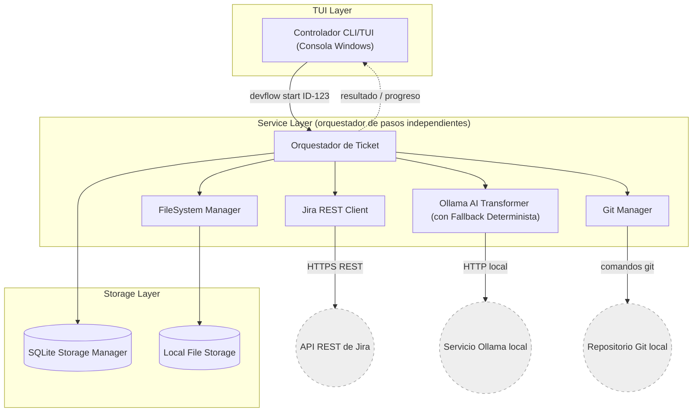
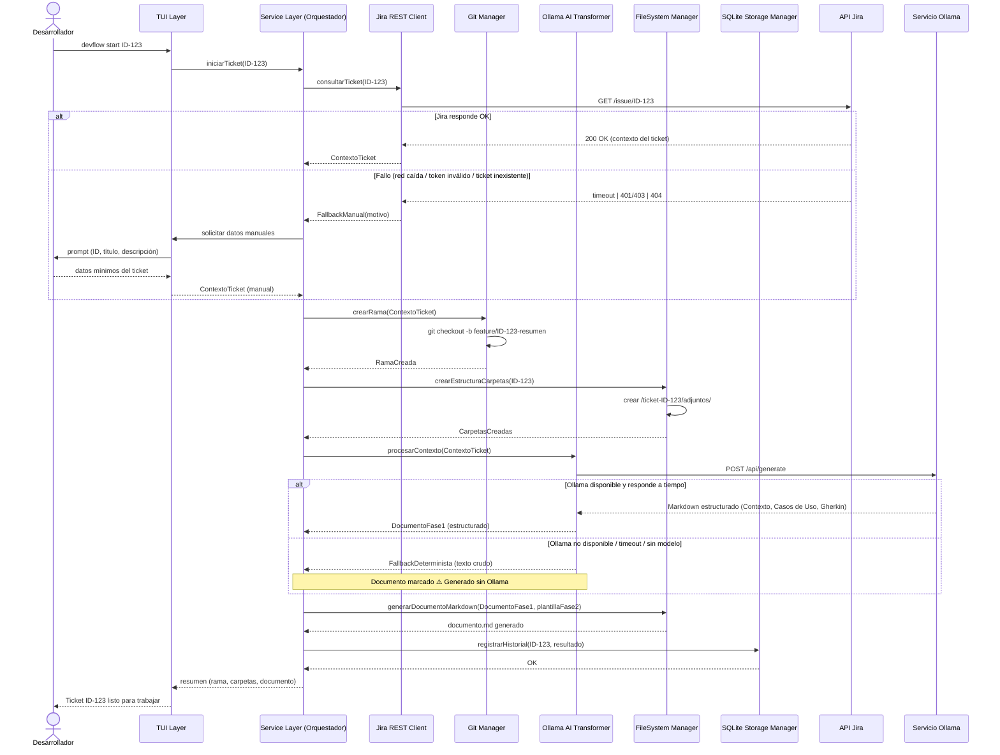

## 2. Arquitectura del Sistema

> Las decisiones de esta sección están respaldadas por el registro formal de decisiones: [`ADR-001-arquitectura-inicial.md`](ADR-001-arquitectura-inicial.md).

### **2.1. Diagrama de arquitectura:**

Patrón adoptado: **3 capas** (ver [ADR-001-arquitectura-inicial.md, §0](ADR-001-arquitectura-inicial.md#0-evaluación-del-patrón-arquitectónico-modular-propuesto-tui-layer--service-layer--storage-layer)):

- **TUI Layer** — interacción con el desarrollador.
- **Service Layer** — orquestador de pasos independientes por integración (no un servicio monolítico), cada uno con resultado `Ok | FallbackManual | FallbackDeterminista | ErrorBloqueante`.
- **Storage Layer** — acceso a SQLite y al sistema de archivos.

**Diagrama de componentes:**



> `ORCH --> SQLITE` es la **única** flecha hacia la Storage Layer: el Orquestador es el único componente que escribe en `ticket_logs`, al finalizar el flujo, con el resultado agregado de todos los pasos. Jira REST Client, Ollama AI Transformer y Git Manager no acceden a SQLite directamente — así el `SQLite Storage Manager` sigue siendo el único punto de acceso a la Storage Layer y ningún componente de integración necesita conocer su esquema.

**Diagrama de secuencia E2E** (`devflow start ID-123`):



**Justificación del patrón de 3 capas** (ver [ADR-001-arquitectura-inicial.md](ADR-001-arquitectura-inicial.md)):

El diagrama de secuencia materializa el ajuste exigido en el [§0 del ADR-001](ADR-001-arquitectura-inicial.md#0-evaluación-del-patrón-arquitectónico-modular-propuesto-tui-layer--service-layer--storage-layer): la Service Layer no es un método lineal con un único bloque try/catch, sino un **orquestador de pasos independientes** (Jira, Git, FileSystem, Ollama), donde cada paso devuelve explícitamente `Ok`, `FallbackManual`, `FallbackDeterminista` o `ErrorBloqueante` sin detener el flujo completo ante un fallo aislado. `ErrorBloqueante` cubre los fallos que no tienen un camino de fallback definido (p. ej. repositorio no encontrado, permisos insuficientes al escribir en disco): en esos casos el Orquestador detiene el flujo y reporta a la TUI qué pasos sí se completaron, dejando la resolución en manos del desarrollador (ver Git Manager y FileSystem Manager en §2.2). La rama de fallback de Jira corresponde a la clasificación de errores y a la autenticación sin navegador decidida en [ADR-001.1](ADR-001-arquitectura-inicial.md#adr-0011-interfaz-clitui-frente-a-aplicación-gráfica-guiweb); la rama de fallback de Ollama corresponde directamente a [ADR-003.1](ADR-001-arquitectura-inicial.md#adr-0031-llm-local-ollama-con-fallback-determinista-frente-a-apis-cloud-openaianthropic); la persistencia del historial vía `SQLite Storage Manager` corresponde a [ADR-002.1](ADR-001-arquitectura-inicial.md#adr-0021-persistencia-en-sqlite-embebida-frente-a-archivos-planos-jsonyaml); y la escritura de carpetas/documento en disco local corresponde a [ADR-004.1](ADR-001-arquitectura-inicial.md#adr-0041-almacenamiento-local-de-evidencias-en-carpeta-del-ticket-frente-a-sincronización-automática-con-google-drive).

### **2.2. Descripción de componentes principales:**

El PRD (sección "Alcance del MVP") y el ADR-001 definen los siguientes componentes funcionales, agrupados por capa, ya con su decisión tecnológica aprobada. El lenguaje/runtime de implementación está en evaluación y se cierra en la próxima entrega; la propuesta de partida es TypeScript sobre Node.js (ver §2.3 y `docs/008-evaluacion-stack-tecnologico.md`):

**TUI Layer**

- **Controlador de interfaz de consola (Windows):** único punto de entrada del usuario (`devflow start <ID>` y comandos relacionados). Se comunica con el Orquestador de forma **asíncrona basada en eventos de progreso** (`onStep(paso, estado)`), no mediante una única llamada bloqueante — esto le permite renderizar spinners/estado en vivo durante los pasos que pueden tardar (consulta a Jira, procesamiento con Ollama) en vez de quedar "congelada" hasta el resultado final. Renderiza también prompts (incluida la carga manual del fallback de Jira), menús de selección y el resumen final de la ejecución; nunca accede directamente a la Storage Layer ni a servicios externos — todo pasa por el Orquestador de la Service Layer. Decisión: [ADR-001.1](ADR-001-arquitectura-inicial.md#adr-0011-interfaz-clitui-frente-a-aplicación-gráfica-guiweb) — CLI/TUI frente a GUI/Web.

**Service Layer** *(orquestador de pasos independientes — ver [ADR-001, §0](ADR-001-arquitectura-inicial.md#0-evaluación-del-patrón-arquitectónico-modular-propuesto-tui-layer--service-layer--storage-layer))*

Toda la configuración que necesitan estos componentes (token de Jira, host/modelo de Ollama, rutas de repositorios, timeouts) se resuelve **una única vez**, al arrancar la herramienta, leyéndola del `SQLite Storage Manager`; el Orquestador la inyecta por constructor a cada componente. Ninguno de los componentes de integración (Jira REST Client, Ollama AI Transformer, Git Manager, FileSystem Manager) lee configuración por su cuenta ni accede directamente a SQLite — esto los mantiene fácilmente testeables con mocks simples de configuración.

- **Orquestador de Ticket:** coordina la secuencia de pasos (Jira → Git → FileSystem → Ollama) sin acoplarlos entre sí, emitiendo un evento de progreso por paso hacia la TUI. Cada paso devuelve `Ok | FallbackManual | FallbackDeterminista | ErrorBloqueante` y el orquestador decide cómo continuar sin abortar el flujo completo ante un fallo aislado; ante `ErrorBloqueante` detiene el flujo y reporta qué pasos sí se completaron. Es el **único** componente que escribe en `ticket_logs` (ver Storage Layer), al finalizar el flujo, con el resultado agregado de todos los pasos — ningún componente de integración escribe en SQLite directamente.
- **Jira REST Client:** consulta **directamente** los endpoints REST de Jira (`GET /rest/api/*/issue/{id}`) — sin intermediar un MCP Server (p. ej. Atlassian Rovo MCP) — autenticado mediante API Token/PAT (sin OAuth con navegador). Parsea la respuesta JSON con un mapeo determinista a `ContextoTicket`, sin consumir presupuesto de contexto de ningún LLM para esta operación. Aplica **un único reintento con backoff corto** (p. ej. 2s) ante un timeout antes de declarar el fallo, y clasifica el resultado en al menos cuatro causas — red caída/timeout persistente, token inválido/expirado (401/403), ticket inexistente (404), límite de peticiones excedido (429, respetando el header `Retry-After` si Jira lo envía) — devolviendo `FallbackManual` con el motivo cuando corresponde. Recibe `jira_base_url`, `jira_api_token` y `jira_timeout_seconds` (tabla `app_config`, ver §3) inyectados por el Orquestador. Es el único componente que conoce el contrato de la API de Jira, aislando ahí cualquier cambio de versión de esa API. Opera sobre un único repositorio por ejecución (sin soporte multi-repo en una misma corrida). Decisiones: [ADR-001.1](ADR-001-arquitectura-inicial.md#adr-0011-interfaz-clitui-frente-a-aplicación-gráfica-guiweb) y [ADR-005.1](ADR-001-arquitectura-inicial.md#adr-0051-integración-directa-con-jira-rest-api-frente-a-consumo-vía-mcp-server) — REST directo frente a consumo vía MCP Server.
- **Ollama AI Transformer (con Fallback):** arma el prompt a partir del contexto del ticket e invoca el modelo local vía HTTP, esperando una respuesta en **JSON estructurado** (`{ contexto, casosDeUso, gherkin }`), validada contra un schema antes de renderizarse a Markdown. Si el servicio no responde a tiempo, no está disponible, no tiene el modelo instalado, **o responde pero el JSON no valida contra el schema (incluye código fuente, está mal formado, o le faltan campos)**, retorna `FallbackDeterminista`: el texto crudo de Jira sin estructurar, marcado con `⚠️ Generado sin Ollama`. Esta validación de forma es lo que hace verificable en código la garantía del PRD de que el LLM nunca inserta código fuente en el documento. Recibe `ollama_host`, `ollama_model` y `ollama_timeout_seconds` inyectados por el Orquestador. Decisión: [ADR-003.1](ADR-001-arquitectura-inicial.md#adr-0031-llm-local-ollama-con-fallback-determinista-frente-a-apis-cloud-openaianthropic).
- **Git Manager:** resuelve la ruta local del repositorio a partir de la configuración por proyecto (tabla `projects_config`, ver §3), calcula el nombre de rama estandarizado (`feature|bugfix/ID-resumen`) y ejecuta **exclusivamente** la creación/cambio de rama (`git checkout -b`) sobre el repositorio del desarrollador. Detecta y reporta el caso de rama ya existente. **Su única escritura sobre el repositorio del proyecto es la rama en sí**: no hace `commit`, no hace `add`, no hace `push` ni modifica ningún archivo trackeado del repositorio — el código y los archivos del proyecto de desarrollo quedan intactos, tal como estaban antes de ejecutar la herramienta.

  **Alcance de la validación (deliberadamente mínimo para el MVP):** antes de crear la rama, el Git Manager solo verifica (a) que el repositorio local exista en la ruta configurada y (b) que la rama a crear no exista ya. El resultado que reporta al Orquestador se limita a: rama creada (con su nombre) / rama no creada porque ya existía. **No** valida estado del working directory, no hace `fetch`/`pull` de la rama base, ni detecta bloqueos del repositorio (p. ej. `.git/index.lock`) — cualquier otro problema de Git (repositorio bloqueado, cambios sin commitear, permisos, conflictos) queda fuera del alcance de la herramienta y es responsabilidad del desarrollador resolverlo manualmente con su cliente Git habitual.
- **FileSystem Manager:** crea la estructura `/ticket-ID/adjuntos/` y escribe el documento Markdown (combinando el resultado del Ollama AI Transformer en Fase 1 con la plantilla estática de Fase 2) **enteramente fuera del repositorio Git del proyecto**, en una ubicación separada del sistema de archivos local de la PC Windows del desarrollador (p. ej. `%USERPROFILE%\DevFlowCLI\tickets\ID-123\`), no dentro de `<repo>\...`. Este componente **no interactúa con Git en absoluto**: no crea, modifica ni referencia ningún archivo dentro del repositorio del proyecto donde se desarrolla — el repositorio de código permanece sin cambios salvo por la rama creada por el Git Manager. Esta separación es intencional: evita que carpetas/documentos de gestión del ticket terminen commiteados, trackeados o siquiera visibles para Git, y confirma que la persistencia de evidencias/documentación es exclusivamente local a la máquina Windows del desarrollador (sin sincronización remota en el MVP). Es **idempotente solo para la Fase 1**: si el ticket ya fue iniciado antes, una reejecución (p. ej. para reprocesar tras un `FallbackDeterminista` de Ollama) regenera únicamente las secciones auto-generadas del documento, preservando siempre el contenido de Fase 2 que el desarrollador ya haya completado (Objetos Modificados, Evidencias, Pasaje a Producción). No escribe bytes directamente a disco: delega esa operación al `Local File Storage` de la Storage Layer, limitándose a decidir *qué* escribir, con qué plantilla y en qué ruta. Decisión: [ADR-004.1](ADR-001-arquitectura-inicial.md#adr-0041-almacenamiento-local-de-evidencias-en-carpeta-del-ticket-frente-a-sincronización-automática-con-google-drive) — carpeta local frente a sincronización con Google Drive.

**Storage Layer**

- **SQLite Storage Manager:** único componente del sistema con acceso a `app_config`, `projects_config` y `ticket_logs` (esquema detallado en `003-modelo-de-datos.md`) — ningún otro componente lee ni escribe SQLite directamente (ver nota del diagrama de componentes más arriba). Expone también las consultas agregadas que alimentan la métrica "tasa de éxito sin fallback" del PRD. Decisión: [ADR-002.1](ADR-001-arquitectura-inicial.md#adr-0021-persistencia-en-sqlite-embebida-frente-a-archivos-planos-jsonyaml) — SQLite embebida frente a archivos planos.
- **Local File Storage:** capa de acceso a disco sin conocimiento del dominio del ticket — expone únicamente operaciones genéricas (`write(path, content)`, `exists(path)`) usadas por el `FileSystem Manager` de la Service Layer para persistir el documento Markdown y crear la carpeta de adjuntos. Al no conocer el dominio, mantiene la Storage Layer simétrica entre SQLite (datos estructurados) y disco (archivos), sin lógica de negocio filtrándose a esta capa.

Lenguaje/runtime de implementación de cada componente: **en evaluación (se cierra en la próxima entrega)**; la propuesta de partida es **TypeScript sobre Node.js** (ver §2.3, junto con el framework de TUI y el árbol de directorios completo, y `docs/008-evaluacion-stack-tecnologico.md`). [A definir] — la definición exacta de campos de `ContextoTicket` y del schema JSON validado del Ollama AI Transformer (el contrato de resultado entre capas — `Ok | FallbackManual | FallbackDeterminista | ErrorBloqueante`, comunicación por eventos de progreso, e inyección de configuración por constructor — ya quedó fijado arriba).

#### **2.2.1. Viabilidad Técnica de Componentes e Integraciones Pre-Código**

Antes de iniciar la implementación (TK-01, TK-02, TK-03), se audita aquí la viabilidad real de cada integración externa que la arquitectura asume, para confirmar que no existen bloqueos técnicos ocultos detrás de las decisiones ya tomadas en el ADR-001.

**1. Matriz de Viabilidad de Integraciones**

| Componente | Mecanismo Técnico | Viabilidad | Estrategia de Fallback / Resiliencia |
|---|---|---|---|
| **Jira REST Client** | HTTP directo contra la API REST de Jira, autenticado con API Token/PAT ([ADR-001.1](ADR-001-arquitectura-inicial.md#adr-0011-interfaz-clitui-frente-a-aplicación-gráfica-guiweb), [ADR-005.1](ADR-001-arquitectura-inicial.md#adr-0051-integración-directa-con-jira-rest-api-frente-a-consumo-vía-mcp-server)) | ✅ **Alta** — protocolo HTTP estándar, sin infraestructura adicional ni flujo de navegador | Reintento único con backoff corto; 4 causas de fallo clasificadas (timeout, 401/403, 404, 429) → `FallbackManual` con carga manual por TUI, sin bloquear el resto del flujo |
| **Ollama Local** | HTTP/JSON contra el servicio local de Ollama (`ollama_host`, por defecto `http://localhost:11434`) ([ADR-003.1](ADR-001-arquitectura-inicial.md#adr-0031-llm-local-ollama-con-fallback-determinista-frente-a-apis-cloud-openaianthropic)) | ✅ **Alta**, condicionada a que el desarrollador tenga Ollama instalado y un modelo descargado — su ausencia degrada el resultado, no bloquea la herramienta | Timeout configurable (`ollama_timeout_seconds`) + validación de schema JSON de la respuesta → `FallbackDeterminista` (texto crudo sin estructurar, marcado `⚠️ Generado sin Ollama`) |
| **Git Local Engine** | Invocación de comandos Git (`git checkout -b`) sobre el repositorio local vía CLI | ✅ **Alta** — Git ya es una dependencia asumida por el flujo de trabajo diario del equipo | Alcance mínimo deliberado (ver Git Manager, arriba): solo verifica existencia del repo y no-duplicidad de la rama → `ErrorBloqueante` si el repo no existe; rama ya existente se reporta como resultado normal, no como error |
| **SQLite (DDL local)** | Motor embebido de archivo único, sin proceso servidor ([ADR-002.1](ADR-001-arquitectura-inicial.md#adr-0021-persistencia-en-sqlite-embebida-frente-a-archivos-planos-jsonyaml)) | ✅ **Alta** — cero infraestructura, drivers maduros disponibles en cualquier stack | Modo WAL para tolerar escrituras concurrentes (dos ejecuciones del CLI a la vez); sin red de por medio, el único fallo realista es de permisos/disco → `ErrorBloqueante` |

**2. Requisitos Previos del Entorno Windows**

- Git instalado y disponible en el `PATH` del sistema.
- Ollama instalado localmente, con el servicio activo en el puerto configurado (`ollama_host`, por defecto **11434**) y al menos un modelo descargado (`ollama_model`).
- Conectividad de red hacia la instancia de Jira del equipo (`jira_base_url`), sin requerimientos de proxy/VPN más allá de los que el desarrollador ya usa para acceder a Jira desde el navegador.
- **API Token / Personal Access Token de Jira** válido, generado y configurado en `app_config` antes del primer uso — no hay flujo OAuth que lo resuelva automáticamente (ver [ADR-001.1](ADR-001-arquitectura-inicial.md#adr-0011-interfaz-clitui-frente-a-aplicación-gráfica-guiweb)).
- Permisos de lectura/escritura del usuario de Windows sobre: (a) la ruta local de cada repositorio configurado en `projects_config`, y (b) la carpeta de trabajo de tickets fuera del repositorio (p. ej. `%USERPROFILE%\DevFlowCLI\tickets\`).
- Permisos de escritura sobre `%APPDATA%\DevFlowCLI\` para el archivo `devflow.db` (SQLite).
- **Sin requisitos de puertos entrantes** ni servidor propio expuesto — toda la comunicación de la herramienta es saliente (hacia Jira y hacia Ollama local).

**3. Análisis de Riesgos y Puntos de Fricción**

- **Ollama sin recursos suficientes (VRAM/RAM insuficiente, modelo no cargado):** el timeout (`ollama_timeout_seconds`) actúa como corte determinista; la arquitectura ya trata este caso como un camino de primera clase (`FallbackDeterminista`), no como una excepción sin manejar — la TUI nunca queda esperando indefinidamente, y el flujo completo (rama + carpetas + documento) se completa igual.
- **Timeouts o caída de red hacia Jira** (VPN corporativa, firewall, instancia de Jira caída): mitigado con reintento único + clasificación explícita de la causa (`FallbackManual`), degradando a carga manual de datos por TUI sin bloquear la creación de rama/carpetas.
- **Permisos de carpeta en Windows** (ruta de repo sin acceso, carpeta bloqueada por antivirus, o sincronizándose vía OneDrive): no tiene un camino de degradación silenciosa — se clasifica explícitamente como `ErrorBloqueante`, deteniendo únicamente ese paso y reportando a la TUI qué se alcanzó a completar, sin dejar el proceso en un estado ambiguo.
- **Token de Jira inválido o expirado:** cubierto por el mismo camino de `FallbackManual` que la caída de red (401/403); al no existir OAuth, no hay refresco automático — el desarrollador corrige el token en su configuración y reintenta.
- **Rama Git ya existente / repositorio no encontrado:** tratados de forma explícita y distinta entre sí (rama existente = resultado informativo, no error; repositorio no encontrado = `ErrorBloqueante`) — ninguno de los dos llega a la TUI como una excepción cruda.
- **Ejecución concurrente del CLI** (dos terminales abiertas a la vez): mitigado a nivel de Storage Layer con SQLite en modo WAL ([ADR-002.1](ADR-001-arquitectura-inicial.md#adr-0021-persistencia-en-sqlite-embebida-frente-a-archivos-planos-jsonyaml)); no mitigado a nivel de Git — dos ejecuciones simultáneas sobre el mismo repositorio quedan fuera del alcance mínimo ya decidido para el Git Manager.

El denominador común: **ningún fallo de una integración externa se propaga como una excepción no controlada hacia la TUI.** Cada paso del Orquestador retorna uno de los cuatro resultados ya tipificados (`Ok | FallbackManual | FallbackDeterminista | ErrorBloqueante`), y es la TUI —nunca el componente que falló— quien decide cómo comunicarlo al desarrollador.

**4. Dictamen Final de Viabilidad (Readiness Gate)**

Los cuatro mecanismos de integración evaluados (Jira REST, Ollama HTTP/JSON, Git CLI, SQLite embebida) se apoyan en protocolos y herramientas estándar, ampliamente soportados en Windows 10/11, sin infraestructura adicional propia (sin servidor expuesto, sin OAuth, sin dependencia de servicios cloud de terceros). Cada uno de sus modos de fallo conocidos ya tiene una estrategia de resiliencia definida y trazable a una decisión de arquitectura aprobada (ADR-001.1 a ADR-005.1), sin dejar ningún camino de error sin clasificar.

> **Veredicto: arquitectura [100% VIABLE Y CONSTRUIBLE DESDE CERO]** para iniciar la implementación de TK-01, TK-02 y TK-03 sin bloqueos técnicos pendientes de resolución.

### **2.3. Descripción de alto nivel del proyecto y estructura de ficheros**

**Stack técnico en evaluación (se cierra en la próxima entrega):** la propuesta de partida es **TypeScript sobre Node.js (LTS ≥ 20.x)**. La comparación frente a Bash + curl + jq, Java CLI, PowerShell, Python y Go, según las restricciones de hardware del equipo (8 GB de RAM, ~35 GB libres, IDEs pesados abiertos a la vez), está en `docs/008-evaluacion-stack-tecnologico.md`. Justificación de la propuesta de partida: (a) las tres integraciones externas de la Service Layer son HTTP/JSON (Jira, Ollama) o invocación de procesos (Git), casos de uso nativos de Node; (b) los contratos ya definidos en §2.2 y en los tickets técnicos (`StepResult<T>`, `ContextoTicket`, `TicketRunSummary`) ya están expresados en sintaxis TypeScript, por lo que elegir TypeScript no introduciría una decisión nueva, formalizaría una ya implícita; (c) 2 de los 5 desarrolladores del equipo ya trabajan a diario con Node/npm (stack Angular), reduciendo la fricción de onboarding sobre la propia herramienta; (d) existen drivers SQLite embebidos maduros para Node (`better-sqlite3` / `node:sqlite`) que soportan modo WAL (ADR-002.1).

**Framework de TUI (propuesta de partida, sujeto a la misma evaluación):** **[Ink](https://github.com/vadimdemedes/ink)** (renderizado de terminal basado en componentes, estilo React) + **Commander** para el parsing de comandos (`devflow start <ID>`, `devflow config ...`) + **`@inquirer/prompts`** para los prompts de confirmación y carga manual. Justificación: el modelo de comunicación TUI↔Orquestador ya decidido en §2.2 es **basado en eventos de progreso** (`onStep(paso, estado)`) — Ink encaja de forma natural porque cada evento se traduce en una actualización de estado de componente (React-like) que Ink vuelve a renderizar automáticamente (spinners vía `ink-spinner`, vistas de resumen/fallback como componentes), sin lógica manual de redibujado de pantalla. Se descartó Blessed por ser imperativo y de mantenimiento más limitado frente a un modelo de actualización por eventos.

Árbol de directorios del repositorio, alineado a las 3 capas del ADR-001 y con el stack de la propuesta de partida (se adapta si la evaluación de `docs/008-evaluacion-stack-tecnologico.md` concluye otro stack):

```
devflow-cli/
├── package.json                    # Proyecto Node.js/TypeScript: dependencias, scripts (build, test, start)
├── tsconfig.json                   # Configuración del compilador TypeScript
├── docs/                           # PRD, ADRs, especificación de arquitectura y de datos
│   ├── PRD.md
│   ├── ADR-001-arquitectura-inicial.md
│   ├── 002-arquitectura-del-sistema.md
│   └── 003-modelo-de-datos.md
├── src/
│   ├── tui/                        # TUI Layer — TypeScript + Ink + Commander
│   │   ├── cli.ts                  # Entry point: registro de comandos (Commander) — `devflow start`, `devflow config`
│   │   ├── app.tsx                 # Componente raíz de Ink; monta la vista según el comando invocado
│   │   ├── components/             # Componentes Ink: ProgressView, SummaryView, FallbackView, spinners (ink-spinner)
│   │   ├── prompts/                # Prompts interactivos (@inquirer/prompts): carga manual, confirmación de acciones
│   │   └── hooks/                  # Hooks de estado Ink que consumen los eventos onStep del Orquestador
│   ├── services/                   # Service Layer — TypeScript puro, sin dependencia de Ink/Commander
│   │   ├── orchestrator/
│   │   │   └── ticket-orchestrator.ts   # Coordina los pasos independientes (Jira/Git/FS/Ollama)
│   │   ├── jira/
│   │   │   └── jira-rest-client.ts      # Cliente REST + clasificación de errores (red/token/404/429)
│   │   ├── ollama/
│   │   │   ├── ollama-ai-transformer.ts # Prompt building + invocación HTTP + fallback determinista
│   │   │   └── ollama-response.schema.ts # Schema de validación del JSON de respuesta del modelo
│   │   ├── git/
│   │   │   └── git-manager.ts           # Verificación de repo/rama + creación de rama (alcance mínimo)
│   │   └── filesystem/
│   │       └── filesystem-manager.ts    # Decide qué escribir y en qué ruta (documento en 2 fases)
│   ├── database/                   # Storage Layer — TypeScript + driver SQLite embebido (better-sqlite3 / node:sqlite)
│   │   ├── sqlite-storage-manager.ts
│   │   ├── local-file-storage.ts        # I/O genérico de disco (write/exists), sin lógica de dominio
│   │   ├── migrations/                  # Migraciones versionadas del esquema (ver §3.2)
│   │   └── schema.sql
│   └── shared/                      # Tipos, DTOs, contratos y configuración comunes a las 3 capas
│       ├── config/
│       │   └── app-config.provider.ts   # Resolución única de configuración e inyección por constructor
│       ├── errors/
│       │   └── result.types.ts          # Ok | FallbackManual | FallbackDeterminista | ErrorBloqueante
│       └── types/
│           ├── contexto-ticket.types.ts
│           └── config.types.ts
├── templates/
│   └── ticket-document.md.hbs      # Plantilla del documento: Fase 1 (generada) + Fase 2 (a completar)
├── tests/
│   ├── unit/                       # Pruebas por componente (mocks de Jira/Ollama/Git/SQLite)
│   └── integration/                # Pruebas del flujo E2E descrito en el diagrama de secuencia (§2.1)
└── README.md
```

**Responsabilidad de cada carpeta principal:**

| Carpeta | Propósito | Lenguaje / Librerías | Módulos principales | Reglas de acoplamiento |
|---|---|---|---|---|
| `docs/` | Fuente de verdad de producto y arquitectura (PRD, ADRs, especificaciones). | Markdown — sin código. | PRD, ADR-001, 002, 003 | No es consumido por `src/` en tiempo de ejecución. |
| `src/tui/` | TUI Layer: toda interacción con el desarrollador vía consola. | TypeScript, **Ink**, **Commander**, `@inquirer/prompts` | `cli.ts`, `app.tsx`, `components/`, `prompts/`, `hooks/` | Solo puede importar de `src/services/orchestrator/` y `src/shared/`. **No** puede importar nada de `src/database/` ni clientes de `src/services/{jira,ollama,git,filesystem}/` directamente. |
| `src/services/` | Service Layer: orquestación y lógica de negocio de cada integración. | TypeScript puro (sin Ink/Commander) | `orchestrator/`, `jira/`, `ollama/`, `git/`, `filesystem/` | Cada submódulo de integración (`jira/`, `ollama/`, `git/`, `filesystem/`) solo es invocado por `orchestrator/`, nunca directamente por `src/tui/`. Solo `orchestrator/` puede importar `src/database/sqlite-storage-manager.ts`. |
| `src/database/` | Storage Layer: acceso a SQLite y al sistema de archivos. | TypeScript, `better-sqlite3` / `node:sqlite` | `sqlite-storage-manager.ts`, `local-file-storage.ts`, `migrations/` | Único punto de acceso a SQLite de todo el proyecto (ver §2.2). No conoce el dominio del ticket. |
| `src/shared/` | Contratos, tipos y configuración usados por las tres capas. | TypeScript (solo tipos/interfaces + funciones puras) | `config/`, `errors/`, `types/` | No importa nada de `src/tui/`, `src/services/` ni `src/database/` — es la capa más interna, sin dependencias hacia afuera. |
| `templates/` | Plantilla del documento Markdown en sus dos fases. | Handlebars (`.hbs`) | `ticket-document.md.hbs` | Consumida únicamente por `filesystem-manager.ts`. |
| `tests/` | Pruebas unitarias e integración. | TypeScript (mismo runtime que `src/`) | `unit/`, `integration/` | Puede importar cualquier módulo de `src/` con fines de test; ningún módulo de `src/` importa de `tests/`. |

### **2.4. Infraestructura y despliegue**

[A definir en Entrega 2]

### **2.5. Seguridad**

Prácticas ya decididas a nivel arquitectónico (ver ADR-001):

- **Autenticación sin navegador:** el acceso a Jira se realiza mediante API Token / Personal Access Token configurado localmente, sin flujo OAuth con redirección a navegador ([ADR-001.1](ADR-001-arquitectura-inicial.md#adr-0011-interfaz-clitui-frente-a-aplicación-gráfica-guiweb)), reduciendo la superficie de ataque de la herramienta (sin servidor/puerto local expuesto).
- **No exfiltración de datos a terceros:** el procesamiento de texto de tickets se realiza con un LLM local (Ollama); ningún contenido de ticket sale de la red del equipo hacia un proveedor cloud ([ADR-003.1](ADR-001-arquitectura-inicial.md#adr-0031-llm-local-ollama-con-fallback-determinista-frente-a-apis-cloud-openaianthropic)).

[A definir] — cómo se almacena el API Token en SQLite (en claro vs. cifrado con DPAPI de Windows u otro mecanismo) y política de rotación/expiración de credenciales.

### **2.6. Tests**

[A definir en Entrega 2]
