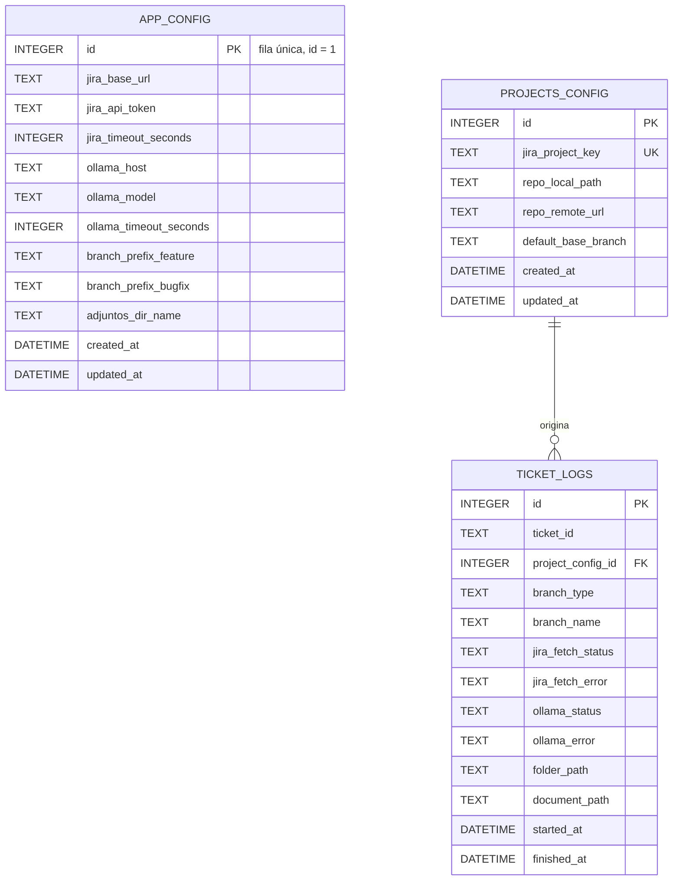

## 3. Modelo de Datos

> Persistencia decidida en [ADR-002.1](ADR-001-arquitectura-inicial.md#adr-0021-persistencia-en-sqlite-embebida-frente-a-archivos-planos-jsonyaml) (SQLite embebida). Consumida por el **SQLite Storage Manager** de la Storage Layer (ver `002-arquitectura-del-sistema.md`, §2.2).

### **3.1. Diagrama del modelo de datos:**



`APP_CONFIG` es una tabla de configuración global de fila única (singleton), sin relación con las demás entidades — por eso aparece sin línea de cardinalidad en el diagrama.

### **3.2. Descripción de entidades principales:**

**`app_config`** — configuración global de la aplicación, fila única (`id = 1`):

| Atributo | Tipo | Restricciones | Descripción |
|---|---|---|---|
| `id` | INTEGER | PK, `CHECK (id = 1)` | Fuerza fila única (patrón singleton). |
| `jira_base_url` | TEXT | NOT NULL | URL base de la instancia de Jira del equipo. |
| `jira_api_token` | TEXT | NOT NULL | API Token/PAT de Jira ([ADR-001.1](ADR-001-arquitectura-inicial.md#adr-0011-interfaz-clitui-frente-a-aplicación-gráfica-guiweb)). Cifrado en reposo: [A definir] (ver `002-arquitectura-del-sistema.md`, §2.5). |
| `jira_timeout_seconds` | INTEGER | NOT NULL, default `10` | Timeout por intento de consulta a Jira; agotado (tras el reintento único) dispara `FallbackManual` (ver `002-arquitectura-del-sistema.md`, §2.2 — Jira REST Client). |
| `ollama_host` | TEXT | NOT NULL, default `http://localhost:11434` | Endpoint HTTP local del servicio Ollama. |
| `ollama_model` | TEXT | NOT NULL | Nombre del modelo local a invocar. |
| `ollama_timeout_seconds` | INTEGER | NOT NULL, default `15` | Timeout tras el cual se activa el `FallbackDeterminista` ([ADR-003.1](ADR-001-arquitectura-inicial.md#adr-0031-llm-local-ollama-con-fallback-determinista-frente-a-apis-cloud-openaianthropic)). |
| `branch_prefix_feature` | TEXT | NOT NULL, default `feature` | Prefijo de rama para historias/funcionalidades. |
| `branch_prefix_bugfix` | TEXT | NOT NULL, default `bugfix` | Prefijo de rama para corrección de errores. |
| `adjuntos_dir_name` | TEXT | NOT NULL, default `adjuntos` | Nombre de la subcarpeta de evidencias por ticket. |
| `created_at` / `updated_at` | DATETIME | NOT NULL | Auditoría de creación/modificación. |

**`projects_config`** — mapeo entre un proyecto/componente de Jira y su repositorio local:

| Atributo | Tipo | Restricciones | Descripción |
|---|---|---|---|
| `id` | INTEGER | PK, AUTOINCREMENT | Identificador interno. |
| `jira_project_key` | TEXT | NOT NULL, UNIQUE | Clave de proyecto en Jira (p. ej. `PAY`, `AUTH`). |
| `repo_local_path` | TEXT | NOT NULL | Ruta absoluta del repositorio local correspondiente. |
| `repo_remote_url` | TEXT | NULL | URL remota del repositorio (informativa). |
| `default_base_branch` | TEXT | NOT NULL, default `main` | Rama base desde la que se crean las ramas de ticket. |
| `created_at` / `updated_at` | DATETIME | NOT NULL | Auditoría de creación/modificación. |

**`ticket_logs`** — historial de tickets procesados; fuente de la métrica "tasa de éxito sin fallback" del PRD:

| Atributo | Tipo | Restricciones | Descripción |
|---|---|---|---|
| `id` | INTEGER | PK, AUTOINCREMENT | Identificador interno. |
| `ticket_id` | TEXT | NOT NULL | ID del ticket en Jira (p. ej. `ID-123`). |
| `project_config_id` | INTEGER | NOT NULL, FK → `projects_config(id)` | Proyecto/repositorio al que pertenece el ticket. |
| `branch_type` | TEXT | NOT NULL, `CHECK IN ('feature','bugfix')` | Tipo de rama creada. |
| `branch_name` | TEXT | NOT NULL | Nombre completo de la rama generada. |
| `jira_fetch_status` | TEXT | NOT NULL, `CHECK IN ('ok','fallback_manual')` | Resultado de la consulta a Jira ([ADR-001.1](ADR-001-arquitectura-inicial.md#adr-0011-interfaz-clitui-frente-a-aplicación-gráfica-guiweb)). |
| `jira_fetch_error` | TEXT | NULL | Motivo del fallo (red / token / 404), si aplica. |
| `ollama_status` | TEXT | NOT NULL, `CHECK IN ('ok','fallback_deterministic')` | Resultado del procesamiento con Ollama ([ADR-003.1](ADR-001-arquitectura-inicial.md#adr-0031-llm-local-ollama-con-fallback-determinista-frente-a-apis-cloud-openaianthropic)). |
| `ollama_error` | TEXT | NULL | Motivo del fallo (no disponible / timeout / sin modelo), si aplica. |
| `folder_path` | TEXT | NOT NULL | Ruta de la carpeta `/ticket-ID/adjuntos/` generada. |
| `document_path` | TEXT | NOT NULL | Ruta del documento Markdown generado. |
| `started_at` | DATETIME | NOT NULL | Inicio de la ejecución (para la métrica de tiempo de arranque del PRD). |
| `finished_at` | DATETIME | NULL | Fin de la ejecución. |

Restricción adicional: `UNIQUE (ticket_id, project_config_id)` — evita registrar el mismo ticket dos veces para el mismo proyecto.

**DDL (SQLite):**

```sql
-- Configuración global de la aplicación (fila única, id = 1)
CREATE TABLE app_config (
    id                      INTEGER PRIMARY KEY CHECK (id = 1),
    jira_base_url           TEXT    NOT NULL,
    jira_api_token          TEXT    NOT NULL,
    jira_timeout_seconds    INTEGER NOT NULL DEFAULT 10,
    ollama_host             TEXT    NOT NULL DEFAULT 'http://localhost:11434',
    ollama_model            TEXT    NOT NULL,
    ollama_timeout_seconds  INTEGER NOT NULL DEFAULT 15,
    branch_prefix_feature   TEXT    NOT NULL DEFAULT 'feature',
    branch_prefix_bugfix    TEXT    NOT NULL DEFAULT 'bugfix',
    adjuntos_dir_name       TEXT    NOT NULL DEFAULT 'adjuntos',
    created_at              DATETIME NOT NULL DEFAULT CURRENT_TIMESTAMP,
    updated_at              DATETIME NOT NULL DEFAULT CURRENT_TIMESTAMP
);

-- Configuración por proyecto Jira / repositorio local
CREATE TABLE projects_config (
    id                  INTEGER PRIMARY KEY AUTOINCREMENT,
    jira_project_key    TEXT    NOT NULL UNIQUE,
    repo_local_path     TEXT    NOT NULL,
    repo_remote_url     TEXT,
    default_base_branch TEXT    NOT NULL DEFAULT 'main',
    created_at          DATETIME NOT NULL DEFAULT CURRENT_TIMESTAMP,
    updated_at          DATETIME NOT NULL DEFAULT CURRENT_TIMESTAMP
);

-- Historial de tickets procesados
CREATE TABLE ticket_logs (
    id                  INTEGER PRIMARY KEY AUTOINCREMENT,
    ticket_id           TEXT    NOT NULL,
    project_config_id   INTEGER NOT NULL REFERENCES projects_config(id),
    branch_type         TEXT    NOT NULL CHECK (branch_type IN ('feature', 'bugfix')),
    branch_name         TEXT    NOT NULL,
    jira_fetch_status   TEXT    NOT NULL CHECK (jira_fetch_status IN ('ok', 'fallback_manual')),
    jira_fetch_error    TEXT,
    ollama_status       TEXT    NOT NULL CHECK (ollama_status IN ('ok', 'fallback_deterministic')),
    ollama_error        TEXT,
    folder_path         TEXT    NOT NULL,
    document_path       TEXT    NOT NULL,
    started_at          DATETIME NOT NULL,
    finished_at         DATETIME,

    UNIQUE (ticket_id, project_config_id)
);

CREATE INDEX idx_ticket_logs_project ON ticket_logs(project_config_id);
CREATE INDEX idx_ticket_logs_ticket_id ON ticket_logs(ticket_id);
```
